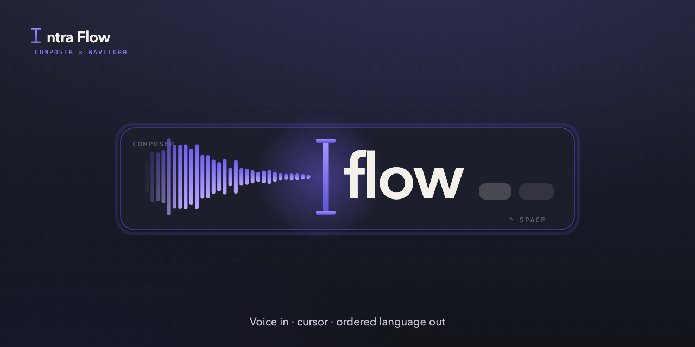

  

<h1 align="center">Intra Flow</h1>

  <strong>The cursor receives the voice.</strong>

  Flow without order disperses. Flow with order creates. 
  Speak to the cursor — and ordered language lands in any Mac app.

  <a href="#download">Download</a> ·
  <a href="#install">Install</a> ·
  <a href="#usage">Usage</a> ·
  <a href="#requirements">Requirements</a> ·
  <a href="#brand">Brand</a>

---

## Overview

Intra Flow is a native **macOS menu-bar** voice app (no Dock icon). Hold a global Trigger, speak, and polished text lands at the cursor in whatever app you’re in.

It’s built for people who think out loud — especially developers who mix Portuguese speech with English technical terms — and who want an LLM to turn a messy brain dump into concise text without a high monthly dictation subscription.

**Bring your own OpenAI key (BYOK).** Transcription and rewrite use lean models (e.g. `gpt-4o-mini-transcribe` + a small chat model). Your key stays in the Mac Keychain.

### How a Dictation runs

| Stage | What happens |
| --- | --- |
| **Trigger** | Hold the global activation (default: **left-Option**) |
| **Capture** | Live mic while you speak |
| **Transcript** | Speech-to-text (OpenAI Realtime) |
| **Rewrite** | LLM orders the utterance for the destination |
| **Injection** | Text is placed at the cursor in the frontmost app |

### Dev Mode — right shape per Surface

| Surface | Example apps | Output |
| --- | --- | --- |
| Terminal | Terminal, iTerm, Warp | Bare shell command |
| Editor | VS Code, Xcode, JetBrains | Code (identifiers preserved) |
| AI tool | Claude, ChatGPT, Cursor | Optimized English prompt |
| Chat | Slack, Telegram, GitHub Desktop | Structured message / Conventional Commit |
| Generic | Everything else | Translate / polish |

---

## Download

Get the latest macOS build from **[Releases](https://github.com/heliowap/IntraFlowApp/releases/latest)**.

| Asset | Notes |
| --- | --- |
| `IntraFlow-*.dmg` | Beta DMG (Apple Development signed; **not** notarized) — test on a second Mac before sharing |

> This repository ships the **runnable app and product docs only** — not the full engineering monorepo.

---

## Install

Full first-run checklist (Gatekeeper, permissions, API key): **[INSTALL.md](INSTALL.md)**.

Short version:

1. Open the DMG → drag **IntraFlow.app** to **Applications**.
2. First launch (macOS 15 Sequoia): try to open → **System Settings → Privacy & Security → Open Anyway** (not right-click → Open).
3. Allow **Microphone** and enable **Accessibility** for Intra Flow.
4. Paste your **OpenAI API key** when asked (Keychain only).

> This beta is **not** Developer ID + notarized. If it won’t open on a clean Mac (beyond Gatekeeper), don’t send Terminal `xattr` workarounds to creators — wait for a notarized build.

---

## Usage

1. Focus any text field (Notes, Slack, browser, IDE…).
2. **Hold** left-Option (or your bound Trigger in Preferences).
3. Speak freely — hesitations and mixed terms are fine.
4. **Release** — polished text appears at the cursor.

The menu-bar wave glyph is the app. Click it for Preferences, History, Impact, Mode, and Trigger binding.

| Mode | Job |
| --- | --- |
| **Standard** | Dictate → polished prose |
| **Command** | Voice edits over selected text |
| **Whisper** | Quiet / whispered speech |
| **Dev Mode** | Surface-aware output (terminal / editor / AI / chat) |

---

## Requirements

| Need | Notes |
| --- | --- |
| macOS | Apple Silicon or Intel Mac that can run a current macOS |
| OpenAI API key | Org with **Realtime** + **Chat** enabled (BYOK) |
| Permissions | **Microphone** + **Accessibility** |

Distribution is **outside the Mac App Store** (sandbox blocks the global Trigger and Injection).

---

## Brand

Product and brand context (safe public surface):

- [Product](docs/PRODUCT.md)
- [Brand story](docs/BRAND_STORY.md)
- [Brand direction](docs/BRAND.md)
- [Design direction](docs/DESIGN.md)
- [Brand assets](docs/brand/)

---

## Beta note

Current betas are signed with **Apple Development** (free account), not paid **Developer ID + notarization**. On Sequoia, unblock via **Privacy & Security → Open Anyway**. A notarized build is the bar for cold outreach to creators.

Feedback and bugs: [GitHub Issues](https://github.com/heliowap/IntraFlowApp/issues).

---

## License / source

**Proprietary — All Rights Reserved.** See [LICENSE](LICENSE).

This repo distributes the **compiled app** and marketing docs for personal evaluation. Source and engineering notes are not published here. Copyright is automatic; no registration is required for this reservation.
